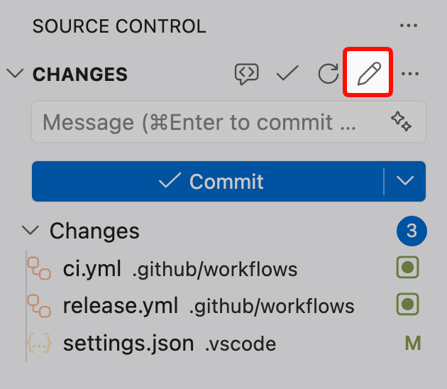
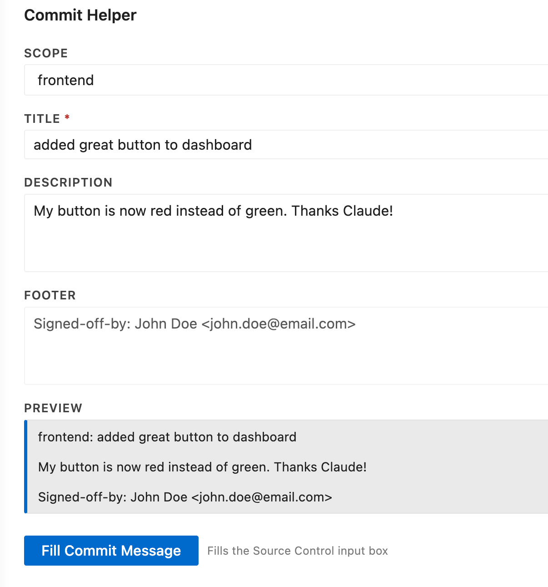

# Commit Components

Write clear, consistent commit messages directly from Source Control.

Commit Components adds a focused commit form to VS Code so you can build commit messages with:

- required scope (free-text, YAML-loaded, or from your global settings list)
- concise title
- optional body/description
- optional footer (for sign-off, issue refs, metadata)

The generated message is written straight into the Git Source Control input box.

## Why Use It

Commit messages are often rushed. This extension helps you keep quality high without slowing down your flow.

- Structured input instead of one big text box
- Live commit preview before applying
- Scope suggestions from your repository YAML or global settings
- Two commit formats: simple (`scope: title`) and conventional (`type(scope): title`)
- Reusable default footer for team conventions
- Generate title and description from your staged diff using GitHub Copilot

## Features

### Source Control action

Open the commit form directly from the Source Control (Git) view.



### Commit form with live preview

Build messages in a clean form and preview the final result as you type.



Generated formats:

```text
# Simple (default)
<scope>: <title>

<description>

<footer>

# Conventional
<type>(<scope>): <title>

<description>

<footer>
```

### Copilot-assisted generation

Click **Generate with Copilot** in the form to automatically pre-fill the title and description from your staged diff. Requires the GitHub Copilot extension to be installed and signed in.

### Scope autoload from YAML

If a `.git_components.yaml` file exists at the workspace root, scope options are loaded automatically.

Supported YAML shapes include:

- string arrays
- object arrays with `name` and optional `owner` (owner is shown alongside the scope name in the dropdown)
- top-level maps (keys used as scopes)

### Global fallback scopes

If no `.git_components.yaml` is present, the scope field becomes a free-text input by default. You can instead define a global list of scopes in `commitComponents.scopes` — they will be shown as a dropdown in every workspace that doesn't have a YAML file.

When a dropdown is active, a **— No scope —** option is always available. Selecting it satisfies the required field but omits the scope prefix from the final message (useful when you want to put the scope in the title yourself).

### Commit format

A **Simple / Conventional** toggle at the top of the form lets you switch formats for each commit. Conventional mode adds a type selector (feat, fix, ci, docs, refactor, test, chore, perf, style, build, revert).

Set `commitComponents.defaultFormat` to `"conventional"` to make that mode the default.

### Default footer support

Set a default footer once and reuse it in every commit form.

If no footer is configured, the extension can prompt you to set one when opening the form.

### Quiet workflow

Applying the commit message does not show success popups, so the flow stays fast and unobtrusive.

## Commands

Available from the Command Palette:

- `Commit Helper: Open Form`
- `Commit Helper: Set Default Footer`

## Configuration

| Setting | Type | Default | Description |
|---|---|---|---|
| `commitComponents.footer` | string | `""` | Default footer appended to every commit message |
| `commitComponents.scopes` | string[] | `[]` | Global fallback scope list (used when no `.git_components.yaml` is found) |
| `commitComponents.defaultFormat` | `"simple"` \| `"conventional"` | `"simple"` | Format pre-selected when opening the form |

Example:

```json
{
  "commitComponents.footer": "Signed-off-by: Jane Doe <jane@example.com>",
  "commitComponents.scopes": ["frontend", "backend", "infra"],
  "commitComponents.defaultFormat": "conventional"
}
```

## How It Works

1. Open Source Control.
2. Launch `Commit Helper: Open Form` (or use the SCM action).
3. Fill title, optional scope/body/footer.
4. Click `Fill Commit Message`.
5. Review and commit from Git panel as usual.

## Requirements

- A Git repository open in VS Code.
- Built-in Git extension enabled.
- GitHub Copilot extension (optional, for Copilot-assisted generation).

## Notes

- If Git is not available, the generated message is copied to the clipboard as fallback.
- Scope suggestions require `.git_components.yaml` in the workspace root.
- Copilot generation requires staged changes and GitHub Copilot to be active.
- Gitlint validation is currently experimental and only runs when a `.gitlint` file exists at workspace root.

## Release Notes

### 0.0.5

- **Global fallback scopes** (`commitComponents.scopes`): define a scope list in settings, used when no `.git_components.yaml` is present.
- **No-scope option**: dropdown includes `— No scope —` to satisfy the required field without adding a scope prefix to the message.
- **Owner display**: if YAML scope entries have an `owner` field, it is shown next to the scope name in the dropdown.
- **Conventional commits format**: Simple / Conventional toggle in the form. Conventional mode adds a type selector (feat, fix, ci, docs, etc.) and produces `type(scope): title`.
- **Default format setting** (`commitComponents.defaultFormat`): controls which format is pre-selected.

### 0.0.4

- Scope field is now required — commit messages always include a scope prefix.
- Added **Generate with Copilot**: pre-fills title and description from staged diff using GitHub Copilot.

### 0.0.3

- Auto-generate footer on first install: if `commit.gpgsign = true` is set in your git config, the extension automatically pre-fills `commitComponents.footer` with `Signed-off-by: <name> <email>` from your git identity. If signing is not enabled, no footer is pre-filled.

### 0.0.2

- Keyboard shortcut (`Cmd/Ctrl+Alt+C`), experimental gitlint support, local/global setting scope for footer.

### 0.0.1

Initial preview release with:

- commit form webview
- SCM integration
- YAML-based scope suggestions
- default footer command and setting
